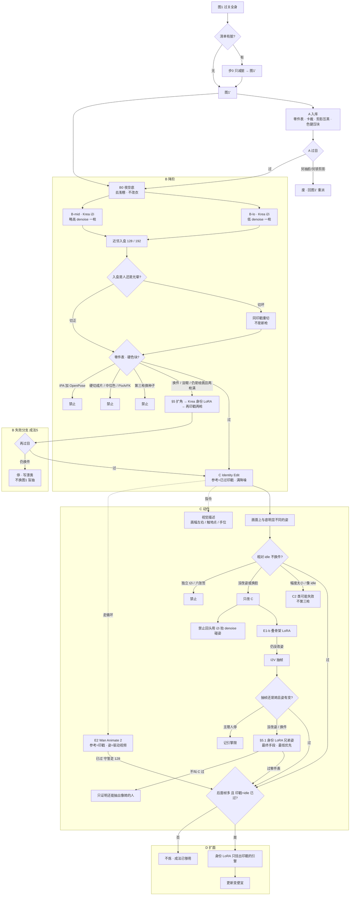
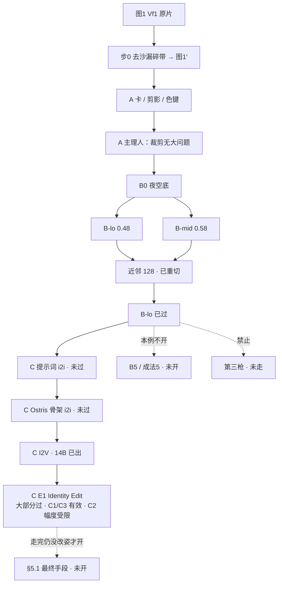

# 角色一致性成法（单源派生）

> 2026-09-10 · **现行（2026-09-17 升格）。** E1 大部分过 · E2 走已过 · E4 / E5 / E6 部分过。**2026-09-23 引擎期望：** 新图片编辑与非二次元 = Qwen-Image-2.1；二次元 = Krea 2；WAI 备用或风格化；本机 H3 分辨率受限，效果不好或需求复杂则反馈主理人调线上满血 H3。已过账不重做。执行抄本文；调研背景见 `combat-identity-pack-v1.md`（合法工表若冲突，**听本文**）。  
> 第一例账本：`identity-validate-vf1-plan-v1.md`（只记 Vf1 实验，不是成法全文）  
> 停手：`combat-identity-drift-v1.md`

新人、新皮肤、一体两面的第二套，都按这份抄。第一例只是用 Vf1 证明抄得通。

---

## 0. 这份文件管什么

| 文件 | 职责 |
|---|---|
| **本文** | 可复用执行流程。以后开新角色只跟这里 |
| `identity-validate-vf1-plan-v1.md` | 第一例过目、步状态、落盘路径（静姿） |
| `identity-validate-vo-walk-v1.md` | 走循环实验账本（E2 已过 · 守誓 S3c-b） |
| `combat-identity-pack-v1.md` | 为什么这样选、办法核对、社区对照 |

账本写「D 轨本例不上」= **这一例先不炼**，先验 A→B→C 够不够。不是成法删掉 LoRA。LoRA 在本文 §4 D 轨、§5（B 换件）、§5.1（C 失败最终手段，最低优先）。

需求仍是：① 零件能指 ② 换动作不乱变形换件 ③ 最低立绘 / 卡 / 战斗帧同一人。

---

## 1. 默认成法（抄这张表）

**一张过关全身图 = 唯一身份源。** 剪影、色键、角色卡、战斗印戳、idle、动作都从它长出。  
不另锁一张剪影再回来对领口。一体两面 = **两张第一图、两份包**。

```
图1（过关全身）
  │ 可选：只减清单脏 → 图1′
  ├─ A  零件表（抄图）· 卡（裁）· 剪影（压黑）· 色键（压块）
  ├─    可选扩料：同人多角度（零件过目后才进包）
  ├─ B  图1′ → 带眼/盔缝印戳 → 近邻入盒（她128 / 他192）
  │       印戳换件且两枪满 → 走 §5，不准第三枪碰运气
  ├─ C  已过印戳 → Qwen-Image-2.1 图片编辑。指令写画面改变，不写解剖。
  │       身份来源在参考里时满降噪合法（R23）。不叠 IPA。E1 的小幅度失效是 Krea 账。
  │       走循环 → E2（Wan Animate 2：参考=已过印戳 · 姿=驱动视频 · 挑六帧）。权重不在盘则停。
  │       E1-b（骨架 LoRA）只补静姿小幅度，点名才开。
  └─ D  包齐且后面帧多 → 身份 LoRA（只挂出印戳的引擎；料必须同意）
```

过目只问零件表，不问「好不好看」。每步过了才下一步。过程进 `_park/`。主理人说「过」之前不写 `frames/`。

---

## 1.1 路线图（方法分岔 · 能走到哪）

验证走通后，**绿线 = 成功成法**。分岔不是「再抽一张」，是不同方法及其停点。第一例进度叠在 §6.1。

图例：`走通` 已过 · `等过目` 已做未点 · `此枪废` 走过且废 · `未开` · `禁止` 不准走。



B 现在能走的合法分岔（第一例正在这条上）：

| 分岔 | 方法 | 合法停点 | 走到过关则证明 |
|---|---|---|---|
| B0 | 图1′ → 夜空底 | 底给 i2i，不改衣 | 降阶不从浅棚开始 |
| B-lo / B-mid | 同底两枪 Krea i2i | 零件在且是硬色块 → 入盒 | **主路。** Krea 软参考够不够 |
| 入盒重切 | 同印戳再抠再近邻 | 只修切，不加种子 | 128 作者仍是印戳 |
| §5 | 扩角过目 → Krea LoRA → 再两枪 | 再过目；仍废则停 | Krea 无稳参考时必须提前挂 LoRA |
| 禁止 | 第三枪 / 硬切 / 中位色 / PixArFK / IPA+OpenPose | 走不到过关 | 这些不是成法 |

C、D 的分岔见上图。双人双 LoRA 以后才挂（守誓+骑士一张立绘），不进第一例。

---

## 2. A 入库

| 产出 | 做法 | 废 |
|---|---|---|
| 零件表 | 从图1′抄 5–8 条，过目能指 | 用另一张锁纸的领/手套/发 |
| 角色卡 | 胸像裁 | 另抽一张脸 |
| 剪影 | 图1′ 去底压实心黑 | 另抽剪影再对齐 |
| 色键 | 图1′ 压成大色块 | 无脸的旧色键当脸源 |

补强只减清单脏（沙漏、浅棚、背景眼）。人、衣、角、鞋不动。

---

## 3. B 降阶

作者：硬色块印戳 → 近邻入盒。**2026-09-23 起，新印戳的扩散作者 = Qwen-Image-2.1**（非二次元 / 图片编辑主力）。已过的守誓 from-a、魔化 B-lo 是 Krea i2i 账，不重做。  
过关：目标画布上能指零件表。丢蕾丝网可以。换头、换裙、没角 = 废。两枪封顶。

不准：硬切绘画大图、像素吸附/中位色当作者、无脸色键当脸、PixArFK t2i、IPA+OpenPose、第三枪 Krea i2i。

Krea 2 **没有**稳参考槽，旧 i2i 印戳会换件。那是 Krea 的账。Qwen 编辑还没有过关印戳账，第一枪同样两枪封顶，换脸即停，走 §5，不加种子。

---

## 4. C 动作 · D 扩面

**C（② 的作者）**  
底 = 已过印戳。**2026-09-23 新作者 = Qwen-Image-2.1 图片编辑**（`QWEN21-图片编辑.json`）。参考在上下文时，EmptyLatent / denoise 1 按身份来源合法（R23）。控制 = 画面向指令。不叠 IPA。条尚未晋升，第一枪须主理人点名并先有 API JSON。  
过关：相对 idle 不换头、不换衣、不全身乱长；姿在画面上可读。  
**已过账（E1，Krea 2 Identity Edit，留档）：** 目标姿须与底图明显不同。叉腰、迈步有效；重心微调 / 与 idle 难分辨的姿可能失效。这不自动套到 Qwen。两枪满停，不加种子。小幅度不够就换更明显的目标姿；E1-b（叠骨架 LoRA）是静姿补救，不是下一条实验。新枪不默认走 Identity Edit。  
**指令：** 写画幅里看见的改变（左右、触地点、肩髋线、手的位置），不要写「她的左腿」这类解剖。要整句，不要词袋。  
废：独立 t2i、六张签混编、站姿当走、纯 t2i + OpenPose、Krea i2i 低 denoise 碰姿。  
**走（E2 · 2026-09-12 过）：** 作者 = Wan Animate 2。参考 = 已过印戳。姿势 = 驱动视频。一次出整段 → 人挑 Williams `a,e,b,c,f,d` → 去底 → 近邻 128（六帧共用缩放与脚底）。Cache cpu/int8 是工况不是可选项。持烛须另给驱动，或接受走里烛偏低 / 空手。128 软可再 B 轨印戳（本例未加）。单人六相位条退备选。C3 只证明静态编辑能出迈步接触预看，不替代走条。账本：`identity-validate-vo-walk-v1.md` · 卡 `exp-e2-wan-animate-walk-v1.md`。  
**场景（E5 · 2026-09-15 部分过）：** 工序 = **少枪优先考虑闭源融景**（Cursor `GenerateImage`，人+景双参考）。条件：角色已设计、这次不是角色抽卡、需要复杂场景和光线、未触闭源限制、预期极少枪。过关：魔化 `identity/scene/e5-graveyard-tombstone.png` · `e5-church-pew.png`。Krea 路 A/B 不过；`03` 里路 B 更好，只对照。姿势日后可再设计——**想法已记，本轮不优化、不重抽**。不当走条、不当角色锁稿、不写 `frames/`。条：`pipelines/scene-closed-source-few-shot/`。  
**视频（E6 · 2026-09-17 部分过）：** 作者 = MiniMax H3（本机开源视频只留它；Wan 2.1 / Animate 2 权重已卸）。首帧 = 过立绘级脸门的竖幅（少枪融景）。**本机日常** = FL2VA I2V（提示词 + 参考图）480×864 × **124** @24fps · 8 步 turbo · `first_frame`（~8.5 min / 8GB），分辨率受限。段间默认 **尾帧续须同时给 last_frame**；长链每 2 段重出一次首帧。**效果不好，或需求更复杂 / 更高 / 更长 / 要参考视频 / 要宣传级：** 停，反馈主理人，由主理人调线上满血 H3。助理不代调官方 API，也不在本机硬撑（0.98MP×362 未达；R2V 0.98×124 约 125 min，不作日常）。过关：魔化 `identity/video/e6-i2v124.mp4` · `e6-s4b.mp4` · `e6-s5.mp4`。不写 `frames/`。条：`pipelines/video-h3-firstframe-chain/`。  
**最终手段（§5.1，最低优先）：** I2V 也走完或主理人点跳过之后，才允许用同意料炼 Krea 身份 LoRA，**出生带姿**收兄弟图。过了不叫 C 过。

**D（更新变便宜，不是第一层身份）**  
同时满足才炼：零件过关的印戳 + 已过 idle + 后面还有走/技能/表情。  
料：图1′、过关多角度、过关印戳、已过战斗帧。失败枪不准进。  
**料来源（E4 · 2026-09-15）：** 过立绘级脸门的 re-stage 可进 `characters/<id>/lora/dataset/<衣套>/`。魔化 / 卡珊德拉第一批 = **Krea 原图**，不挪。图1′ 本身不进。卡珊德拉图1′ 仍为 H23，**不换**。本批各 6 张，是种子集，未达 ≥15–20 训门槛，**未训**。**2026-09-23 新料：** 二次元挂 Krea；非二次元与图片编辑挂 Qwen-Image-2.1；WAI 只在点名风格化时单收。  
**料来源（E5 · 2026-09-15）：** 过关场景成片可进同衣套，**含 Cursor 少枪融景**（魔化 `e5-scene-tombstone.png` / `e5-scene-pew.png`）。禁的是用 GenerateImage **抽角色**再喂 D（浪费），不是禁过关素材。  
新料按出图引擎分轨（二次元 Krea，非二次元 / 编辑 Qwen 2.1）。禁止一条炼两轨、禁止风格+身份炼一条、禁止把 WAI 料挂进 Qwen 或 Krea。

---

## 5. B 印戳换件时怎么走（成法里的 LoRA，不是本例必做）

社区已写明：Krea 2 参考不稳，用 **Krea 2 身份 LoRA** 补（数据集 → Turbo）。这是 B 失败后的分支，不是替代 A/C。

1. 从图1′ 做同人多角度（一图扩角 / 轨道抽帧）。每张过零件表才进训练集。  
2. 在**出印戳的那台引擎**上炼身份 LoRA（低权重）。2026-09-23 起新印戳是 Qwen-Image-2.1。不要用 WAI 立绘 LoRA 挂到 Qwen 或 Krea。  
3. 再出印戳，仍两枪。仍换件：停，写漂类，不第三枪。  
4. Ostris 的 Krea 2 *Edit* 参考训练是「教一种改图」，不是自动认人。不当成本例默认。

没有同意的多角度料，不准为了「先有 LoRA」去炼。

### 5.1 C 失败后的最终手段（身份 LoRA 兄弟姿 · 最低优先）

三条教程补的是 **引擎不认人**，技术上就是「还能不能抽到像她的人」。不拒绝这条，但 **优先级最低**：不证明单源派生能换姿，也不替代 §1 默认 C。

**才开：** C 提示词 i2i、合法骨架 i2i、I2V 抽帧都走完（或主理人点跳过 I2V），且骨架已记引擎限。后面确实还要姿。本例 B 已过，炼 LoRA **只为救姿**，不是为印戳。

**怎么走**

1. 料：图1′、过关扩角、已过印戳/idle。失败枪不准进。每张过零件表。  
2. 只在 **Krea 2** 上炼身份 LoRA（低权重）。不要 WAI 立绘 LoRA 挂到 Krea。  
3. **出生带姿**（LoRA + 骨架或提示词）。不准回头抬已过 idle 的 denoise。  
4. **每姿两枪**。零件表过了才收。两枪都漂 → 这姿停，不第三枪。  
5. 过了：idle 仍是已过那张；新姿是 **兄弟图**。账本写「C 失败分支收了」，**不把本文改成 C 已固定**。  
6. 不自动外推到走六相位。走要另开过目和枪数。

50% 单张过关率不能立项；过关率要炼完按零件表实打。两张静姿可以谈；走循环叠乘会垮。

---

## 6. 第一例怎么证明这份成法能复用

Vf1 账本按 A→B→C 走，**先不炼 D**。

| 若 | 成法怎么落定 |
|---|---|
| B+C 过 | 单源 + Identity Edit 够用。D 留作以后帧多时减成本。本文改「已固定」 |
| B+C 部分（E1） | C 作者换成编辑模型。静姿在画面差足够时可用；小幅度姿可能失效。本文仍草案 |
| B 换件 | 执行 §5（扩料 → Krea LoRA → 再印戳）。过了：成法加上「Krea 无稳参考时 D 提前」。不过：记引擎限制，不换图1 盲抽 |
| C 乱变形 | 只改 C（骨架 / I2V）。不准回头用 i2i 抬 denoise 碰姿。I2V 也完了才允许 §5.1 最终手段（兄弟姿，不叫 C 过） |

复用方法：新角色复制本文 §1–§4，另开一份账本（照 `identity-validate-vf1-plan-v1.md` 的表），第一张图换成那人的过关全身。

### 6.1 第一例 Vf1 · 哪一步走通（2026-09-10）

账本：`identity-validate-vf1-plan-v1.md`。过只听主理人。本图随过目改色，全部绿到 C 才把本文改「已固定」。E1 大部分过不算全绿。



| 节点 | 方法 | 第一例 | 能走到哪 |
|---|---|---|---|
| 图1 | WAI 成片当第一张 | 已定 | 身份源 |
| 步0 | GenerateImage 只减脏 | 已走 | 图1′。手套略长到肘，记小漂 |
| A | 裁 / 压黑 / 压块 | **走通** | 卡、剪影、色键。主理人：裁剪无大问题 |
| B0 | 脚本去棚落到 `#00040C` | 已走 | i2i 底。不改衣 |
| B-lo | Krea i2i denoise 0.48 | **已过** | idle。印戳 + 128 |
| B-mid | Krea i2i denoise 0.58 | **此枪废** | 鞋变黑高跟 |
| 入盒 | 近邻 128 | 已过（跟 B-lo） | 补洞后主理人过 |
| 第三枪 | 换种子 | **禁止 · 未走** | 走不到 |
| B5 / §5 | 扩角 + Krea LoRA | **本例不开** | B 已过，不必走失败分支 |
| C0 提示词 i2i | 过关印戳低 denoise | **未过** | 没改姿。印戳脸漂；**128 脸=呼吸**（主理人）。发/角/衣锁 |
| C 骨架 | 已过印戳 i2i + Ostris image1=骨架 | **未过** | 仍垂手。facok 路已废 |
| C I2V | 14B 枪 A 人锁动小；枪 B 张臂 | **未过** | 人锁、姿不对 |
| C 抬 denoise | 用更高降噪碰姿 | **禁止当下一刀** | 印戳脸已漂 |
| C E1 Identity Edit | 已过印戳 · 满降噪 · 画面向指令 | **大部分过** | C1 叉腰、C3 迈步有效；C2 小幅度可能失效。视觉描述。见 `review-exp-e1/` |
| C E2 走循环 | 印戳 + 驱动视频 · Wan Animate 2 · 挑六帧 | **已过**（守誓 S3c-b） | 现网 `hero-violet-walk-*` 128。烛偏低、未印戳。见 `identity-validate-vo-walk-v1.md` |
| C E6 视频 | 过关竖首帧 · H3 FL2VA 124 · first+last 续段 | **部分过**（魔化 2026-09-17） | 锁 `identity/video/`。Wan 14B 不过。不写 `frames/`。 |
| §5.1 最终手段 | Krea 身份 LoRA 出生带姿 | **本例未开 · 最低优先** | 不拒绝。过了也不叫 C 过 |
| D | 身份 LoRA 减成本 | **本例先不上** | 与 §5.1 不同：D 是帧多了减成本 |

守誓者 idle 192 的 B 与本表 B-lo/B-mid 同构：两枪满、仍是绘画印戳、零件未讨回。那例已停，不并进第一例 Queue。

---

## 7. 三条教程评估（2026-09-10）

未逐帧看完视频，按标题 + 社区同款成法评估。不替代过目原片。

| 条 | 在做什么 | 有效性 | 和本成法 | 本例 |
|---|---|---|---|---|
| **Krea2 没有稳定参考图 → LoRA** [b23.tv/PwO6r4R](https://b23.tv/PwO6r4R) | 承认 Krea 2 参考弱；用身份 LoRA 让 Turbo 认人 | **高，且对口。** 本机印戳正是 Krea 2 | **可参考。** §5 = B 换件后锁人；§5.1 = C 失败后最终手段（兄弟姿，最低优先） | 本例 B 已过。扩角现网是 **t2i 重写词**（2026-09-11），不是 i2i 底图。未炼 |
| **双 LoRA 双角色** [b23.tv/oKHVVMe](https://b23.tv/oKHVVMe) | 两人各一条 LoRA，分区/分触发，减少串人 | 插画双人中高；要分区，否则仍出血 | **以后可参考**（守誓+骑士一张立绘）。不解决 128 动作不变形 | 第一例单人，不搬 |
| **一张图全角度再训 LoRA** [b23.tv/FNkQQMK](https://b23.tv/FNkQQMK) | 一图扩多角度 → 15–30 张同意料 → 炼 | **高，且是 D/§5 的备料法。** 和轨道扩料同构 | **可参考。** 每张角度必须过零件表，漂的不准进训练集 | B 若死，用这个备 Krea 料。不当 128 作者 |

不能参考当**默认战斗作者**的：把 LoRA 当第一张图的替代；双人工作流直接出走循环；扩角图不经过目就炼。

没有更好的「换一套就不用包」的方案。三条都是在补 **引擎不认人**。包 + 零件表 + C 轨 i2i 仍是默认作者。LoRA 是同引擎减漂；C 像素变换走不通时，§5.1 允许它当最终手段抽兄弟姿，优先级最低。
